# NaukriNote Project Map & Feature Tree

This document provides a comprehensive mapping of the **NaukriNote** repository, connecting files to code, and code to features in a graph-like visual structure.

---

## 1. Feature to File Mapping (Core Graph)

```mermaid
graph TD
    %% Roles
    User[User Roles] --> Contractor[Contractor / Manager]
    User --> Worker[Construction Worker]

    %% Feature Groups
    Contractor --> CM[Construction Management]
    Contractor --> PM[Payroll & Attendance]
    Worker --> WM[Worker Self-Service]

    %% Feature Specifics -> Files
    CM --> Sites["Site Management (Geofencing)"]
    Sites --> |UI| SitesPage[src/pages/contractor/SitesDashboard.jsx]
    Sites --> |Logics| SiteService[src/services/firestoreService.js]

    CM --> WorkerMgmt["Worker Onboarding & Assignment"]
    WorkerMgmt --> |UI| WorkerPage[src/pages/contractor/WorkersPage.jsx]
    WorkerMgmt --> |QR Gen| Helpers[src/utils/helpers.js]

    PM --> Attendance["Attendance Marking & Requests"]
    Attendance --> |UI| AttendancePage[src/pages/contractor/AttendancePage.jsx]
    Attendance --> |State| AuthContext[src/context/AuthContext.jsx]

    PM --> Payroll["Automatic Payroll Tracking"]
    Payroll --> |UI| PayrollPage[src/pages/contractor/PayrollPage.jsx]
    Payroll --> |Storage| Firestore[src/firebase/firebaseConfig.js]

    WM --> WorkerLogin["Phone-based Auth"]
    WorkerLogin --> |UI| WLoginPage[src/pages/worker/WorkerLoginPage.jsx]
    
    WM --> GeofenceAuth["Geofenced Attendance Request"]
    GeofenceAuth --> |UI| WHomePage[src/pages/worker/WorkerHomePage.jsx]
    GeofenceAuth --> |Algo| AlgosDoc[Docs/ALGORITHMS.md]

    %% Shared Infra
    Common[Common Components] --> Logo[src/components/common/Logo.jsx]
    Common --> ModalUI[src/components/common/Modal.jsx]
    Common --> Toast[src/components/common/Toast.jsx]
    
    Layout[Layout Shells] --> DashLayout[src/components/layout/DashboardLayout.jsx]
    Layout --> Nav[src/components/layout/PublicNavbar.jsx]
```

---

## 2. Directory Tree & Architecture

### **Global Entry Points**
- `index.html`: Entry point.
- [src/main.jsx](src/main.jsx): React DOM mounting.
- [src/App.jsx](src/App.jsx): Main provider wrapper (`AuthProvider`).
- [src/routes/AppRoutes.jsx](src/routes/AppRoutes.jsx): The central "brain" of navigation.

### **Code Structure**

| Directory | Purpose | Key Files |
| :--- | :--- | :--- |
| **`Docs/`** | Technical & Business documentation. | [ARCHITECTURE.md](Docs/ARCHITECTURE.md), [DATABASE_SCHEMA.md](Docs/DATABASE_SCHEMA.md) |
| **`src/components/common/`** | Atomic, reusable UI elements. | [Logo.jsx](src/components/common/Logo.jsx), [Modal.jsx](src/components/common/Modal.jsx), [Toast.jsx](src/components/common/Toast.jsx) |
| **`src/components/layout/`** | Structural wrappers for different views. | [DashboardLayout.jsx](src/components/layout/DashboardLayout.jsx), [PublicNavbar.jsx](src/components/layout/PublicNavbar.jsx) |
| **`src/context/`** | Global state management. | [AuthContext.jsx](src/context/AuthContext.jsx) (Handles Contractor & Worker Login state) |
| **`src/pages/`** | Full-page views categorized by user role. | `contractor/`, `worker/`, `public/` |
| **`src/services/`** | Data fetching and Firebase interactions. | [firestoreService.js](src/services/firestoreService.js) |
| **`src/utils/`** | Math, formatting, and helper algorithms. | [helpers.js](src/utils/helpers.js) |

---

## 3. Tech Stack Connectivity

- **Core**: React 18, Vite.
- **Styling**: Tailwind CSS (Configuration: [tailwind.config.js](tailwind.config.js)).
- **Database/Auth**: Firebase Firestore & Auth (Config: [src/firebase/firebaseConfig.js](src/firebase/firebaseConfig.js)).
- **Deployment**: Configured for Netlify ([netlify.toml](netlify.toml)), Vercel ([vercel.json](vercel.json)), and Firebase Hosting ([firebase.json](firebase.json)).

---

## 4. Feature Implementation Details

### **Attendance & Geofencing**
1.  **Contractor** sets the center (Lat/Long) and radius in [SitesDashboard.jsx](src/pages/contractor/SitesDashboard.jsx).
2.  **Worker** checks location in [WorkerHomePage.jsx](src/pages/worker/WorkerHomePage.jsx).
3.  **Authentication** for attendance uses [useToast.js](src/hooks/useToast.js) for feedback.

### **Payroll & Payments**
- Wages are dynamically calculated: `Daily Wage * Days Present`.
- UPI QR Codes are stored/generated via Cloudinary or local helper logic in [helpers.js](src/utils/helpers.js).
- Payment history is managed via [firestoreService.js](src/services/firestoreService.js).
